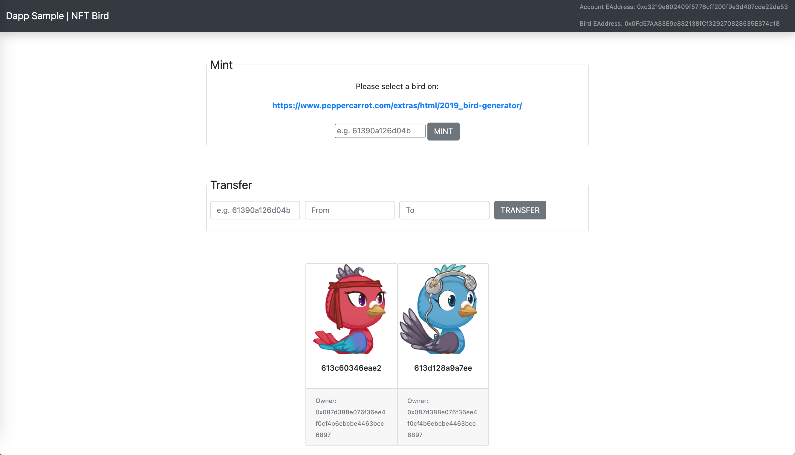

# ethereum-NFT-Bird

# Setup
```
npm install ganache-cli
npm install -g truffle
npm i
rm -fr ./build
truffle compile
ganache-cli -p 7545
truffle migrate
npm run dev
```

# Testing command
```
ganache-cli -p 7545
truffle test --show-events
```

# Screen Shot


# Link
    Custom version from: https://www.dappuniversity.com/articles/blockchain-programming